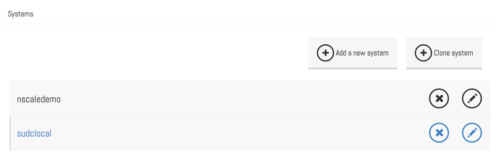
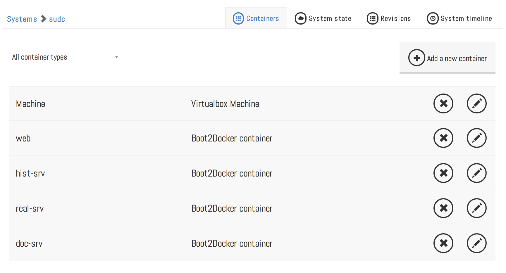
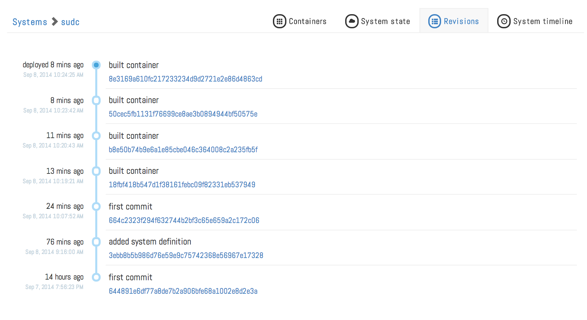
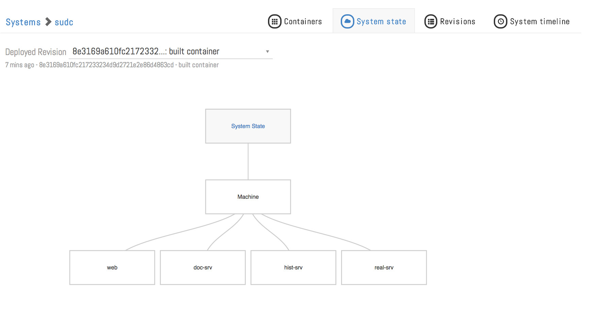
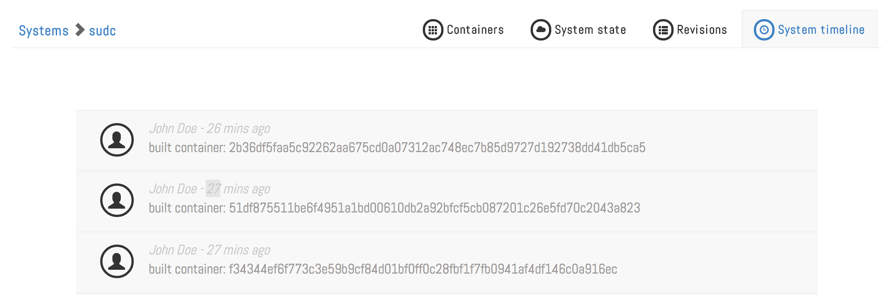

A Larger Application
=======================

This tutorial covers:

1. Deploying a larger application
2. Previewing before deploying
2. The nscale web gui

Clone the Application
---------------------
Lets get started by cloning the repository for a larger application by doing the following:

Pull down the code for the sudc-system:
```bash
git clone git@github.com:nearform/sudc-system.git sudc
nscale system link sudc
```
Compile the system:

```bash
nscale system compile sudc development
```
Now let's take a look at the system definition:

```bash
nscale container list sudc
```
You should see the following containers:

```bash
	root                 root
	web                  docker
	hist                 docker
	real                 docker
	doc                  docker
```

The application is composed of a web front end and three additional services.

Build the system
----------------
Let's go ahead and build the containers ready for deployment:

```bash
nscale container buildall sudc latest development
```

Alternatively, you can build all the containers by themselves:

```bash
nscale container build sudc hist
nscale container build sudc real
nscale container build sudc doc
nscale container build sudc web
```

After those have all completed we should have four containers ready for deployment.

GUI
---
Now we can take a look at the startup death clock system using the graphical interface. We just need to point our browser to <a href="http://localhost:9000" target="_blank">http://localhost:9000</a>.



We can go to the container view via the sudclocal link,



show the revision list by clicking on the Revisions tab,



show the system state by clicking on the System state tab,



and show the timeline by clicking on the System timeline tab.



Previewing the deployment
-------------------------
Before we deploy the system let's take a look at the commands that will be executed on deployment. Fist we can check the revision list:
```bash
nscale revision list sudc
```

We should see some output similar to the following:
```bash
revision             deployed who                                                     time                      description
136c840f016c57d0e23… false    John Doe <john.doe@gmail.com>                           2014-09-08T12:10:11.000Z  built container: 2b36df5faa5c92262aa675cd0a07312a…
31d0cff07829dc15e29… false    John Doe <john.doe@gmail.com>                           2014-09-08T12:09:29.000Z  built container: 51df875511be6f4951a1bd00610db2a9…
7e48d13a98746c8356a… false    John Doe <john.doe@gmail.com>                           2014-09-08T12:09:09.000Z  built container: f34344ef6f773c3e59b9cf84d01bf0ff…
1483ec749e9202dde10… false    John Doe <john.doe@gmail.com>                           2014-09-08T12:08:46.000Z  built container: 25a6d9868347b906345513aaf99e45ad…
5cab4567fef325bba9f… false    John Doe <john.doe@gmail.com>                           2014-09-08T12:06:24.000Z  first commit
3ebb8b5b986d76e59e9… false    Peter Elger <elger.peter@gmail.com>                     2014-09-08T08:16:00.000Z  added system definition
644891e6df77a8de7b2… false    Peter Elger <elger.peter@gmail.com>                     2014-09-07T18:56:23.000Z  first commit


revision             deployed     who                                      time                      description
4eba9c77683f4e5e45d…              Matteo Collina <hello@matteocollina.eom> 2015-01-26T07:33:37.000Z  system compile
3ea94c23652a377d66d…              Matteo Collina <hello@matteocollina.com> 2015-01-26T07:12:58.000Z  system compile
2c9e66a6065fdb55a9b…              Matteo Collina <hello@matteocollina.com> 2015-01-24T10:27:43.000Z  system compile
```

Next let's preview what a deploy of the latest build would look like by previewing the revision id from the top of the revision list:
```bash
nscale revision preview sudc <revision id> <environment>
```

So, we can preview our latest commit with:

```bash
nscale revision preview sudc latest development
```

We should see some output similar to the following:

```bash
--> deploying...
--> deploying plan...
add doc-c31f912e$77c4014bef47deb4fef3af579f2959457c058ce8 docker
deploying
start doc-c31f912e$77c4014bef47deb4fef3af579f2959457c058ce8 docker
starting
link doc-c31f912e$77c4014bef47deb4fef3af579f2959457c058ce8 docker
linking
add hist-b418a1b8$39f0c71b89f3ba78064468c0af79017927f1a6cb docker
deploying
start hist-b418a1b8$39f0c71b89f3ba78064468c0af79017927f1a6cb docker
starting
link hist-b418a1b8$39f0c71b89f3ba78064468c0af79017927f1a6cb docker
linking
add real-2d11f002$5309ad7aeba319fd44adb18bbc983f4587f16af9 docker
deploying
start real-2d11f002$5309ad7aeba319fd44adb18bbc983f4587f16af9 docker
starting
link real-2d11f002$5309ad7aeba319fd44adb18bbc983f4587f16af9 docker
linking
add web-5a16c094$392947a31ae50228176874ba8f1209c5de33d4a7 docker
deploying
start web-5a16c094$392947a31ae50228176874ba8f1209c5de33d4a7 docker
starting
link web-5a16c094$392947a31ae50228176874ba8f1209c5de33d4a7 docker
linking

execution plan:
Command                        Id
add                            doc-c31f912e$77c4014bef47deb4fef3af579f2959457c05…
start                          doc-c31f912e$77c4014bef47deb4fef3af579f2959457c05…
link                           doc-c31f912e$77c4014bef47deb4fef3af579f2959457c05…
add                            hist-b418a1b8$39f0c71b89f3ba78064468c0af79017927f…
start                          hist-b418a1b8$39f0c71b89f3ba78064468c0af79017927f…
link                           hist-b418a1b8$39f0c71b89f3ba78064468c0af79017927f…
add                            real-2d11f002$5309ad7aeba319fd44adb18bbc983f4587f…
start                          real-2d11f002$5309ad7aeba319fd44adb18bbc983f4587f…
link                           real-2d11f002$5309ad7aeba319fd44adb18bbc983f4587f…
add                            web-5a16c094$392947a31ae50228176874ba8f1209c5de33…
start                          web-5a16c094$392947a31ae50228176874ba8f1209c5de33…
link                           web-5a16c094$392947a31ae50228176874ba8f1209c5de33…

operations:
Host                 Command
localhost            docker run  -p 9002:9002 -d localhost:8011/sudc/doc-77c4014bef47deb4fef3af579f2959457c058ce8 node /srv/doc-srv.js && docker tag localhost:8011/sudc/d…
localhost            docker run  -p 9003:9003 -d localhost:8011/sudc/hist-39f0c71b89f3ba78064468c0af79017927f1a6cb node /srv/hist-srv.js && docker tag localhost:8011/sudc…
localhost            docker run  -p 9001:9001 -d localhost:8011/sudc/real-5309ad7aeba319fd44adb18bbc983f4587f16af9 node /srv/real-srv.js && docker tag localhost:8011/sudc…
localhost            docker run  -p 8000:8000 -d localhost:8011/sudc/web-392947a31ae50228176874ba8f1209c5de33d4a7 /bin/bash /web/run.sh && docker tag localhost:8011/sudc/…
```

In order to produce this view, `nscale` has computed a delta between what the latest revisions of the system should look like compared with what is actually running on your system. If you are interested, all the actions are generated using a [task-planning algorithm](http://en.wikipedia.org/wiki/Automated_planning_and_scheduling) (yes, it is an AI branch) which lives in [nscale-planner](https://github.com/nearform/nscale-planner).

Run the deployment
------------------
Let's go ahead and run the deployment:
```bash
nscale revision deploy sudc latest development
```
`nscale` will now execute the deployment that we previewed in the last step. Once this completes we should have a running system composed of four docker containers. We van verify everything's working by pointing our browser to the docker host ip address port 8000 on Mac OS X or localhost on linux.

OS X:
open http://$(boot2docker ip):8000

Linux:
open [localhost:8000](http://localhost:8000)
	

[Next up: exercise 4](./4-config-&-logs.md)
