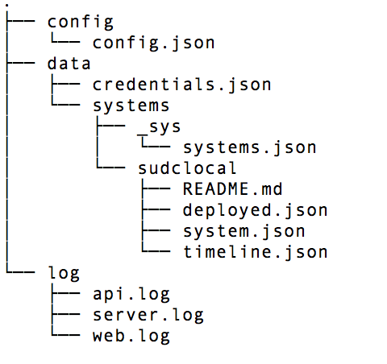

Configuration & Logs
============

This tutorial covers:

1. The nscale configuration file
2. How to view `nscale` server logs

Configuration
-------------
Before we proceed let's just take a look at the `nscale` configuration file. By default this is placed in `~/.nscale/config/config.json`. When we open this file up and inspect it we'll see a JSON file containing several sections that control various aspects of `nscale`.

The kernel section defines the following:

	port - the port the nscale kernel should run on
	root - the full path where all nscale data resides - system data, build data and target data

```js
"kernel": {
"port": "8010",
"root": "/home/me/.nscale"
}
```

Information for AWS is also defined. This is explored in a later tutorial.

The modules section defines the following:

```js
"modules": {
    "protocol": {
      "require": "nscale-protocol",
      "specific": {
      }
    },
    "authorization": {
      "require": "nscale-noauth",
      "specific": {
        "credentialsPath": "/home/dara/.nscale/data"
      }
    },
    "analysis": {
      "require": "nscale-local-analyzer",
      "specific": {
      }
    }
  },
```

Right now we the auth module just picks up your git credentials, however this is open for extension with and can be replaced with other authentication strategies.

The analysis module implements the logic that queries a running system for comparison against the desired system state. Right now nscale has a local boot2docker analyzer and also and Amazon web services analyzer.

The containers section defines the following:

	containers - list of supported container types.

```js
"containers": [
    {"require": "blank-container",
     "type": "blank-container",
     "specific": {}
    },
    {"require": "docker-container",
     "type": "docker",
     "specific": {"imageCachePath": "/tmp"}
    },
    {"require": "process-container",
     "type": "process",
     "specific": {}
    }
  ]
```

For this workshop we are using just the virtualbox and boot2docker containers. Nscale also has additional containers for AWS deployment. The intent is that this provides an open framework for extension into other platforms.

The `nscale` root folder looks as follows:



Viewing the logs
----------------
We can view the nscale logs at any time by running
```bash
nscale server logs
nscale server logs api.log
nscale server logs web.log
```

[Next up: exercise 5](./5-update-&-rollback.md)
