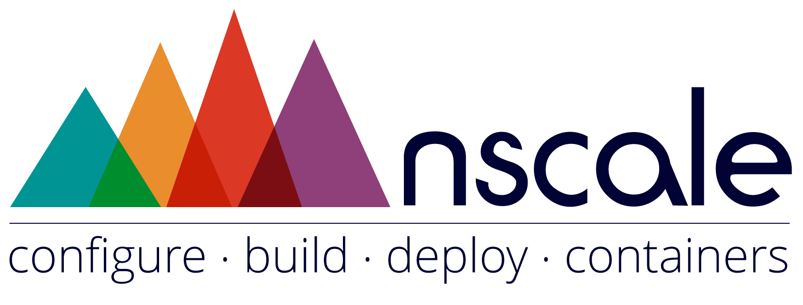

nscale-workshop
===============

##This repository has been deprecated!
___All documents have been moved to our [nscale-docs](https://github.com/nearform/nscale-docs) repo.___

##Preliminary
- [Docker Introduction](./docker-intro.md)
- [Boot2docker OSX Installation using USB (Mac Users Only)](./boot2docker-osx.md)

##Nscale Exercises
1. [Introduction to nscale](./1-nscale-intro.md)
2. [Create a new system](./2-create-a-system.md)
3. [Deploy a larger application](./3-deploy-larger-application.md)
4. [Fixing a bug](./4-config-&-logs.md)
5. [Update & Rollback](./5-update-&-rollback.md)
6. [Automatic system fix](./6-system-fix.md)
7. [Using an image from Docker Hub](./7-using-docker-images.md)
8. [Deploying to AWS](./8-deploy-to-aws.md)

##Extras
- [Deploy directly via SSH to DigitalOcean](./direct-digitalocean.md)
- [Development Workflow Examples](./development-workflow.md)

[do-referral]: https://www.digitalocean.com/?refcode=c85081546a8e
