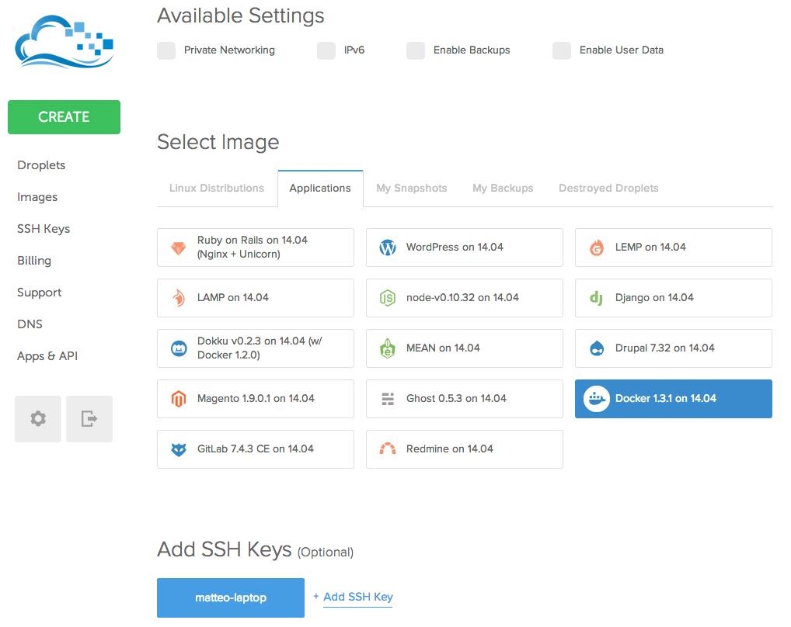
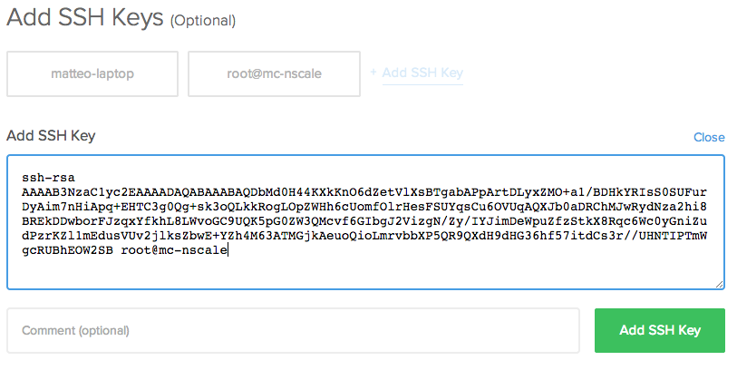

Direct deployment on Digital Ocean
==================================

Since version 0.9 nscale supports _any cloud provider that give SSH
access_, plus bare-metal deployments.

In this tutorial we will use [Digital Ocean][doreferral]. If you do not
have an account, signing up through that link gives you 10$ of credit, enough to run
through this tutorial.

In this tutorial we will deploy our beloved [startup death clock][sudc]
application on a single machine, plus a nscale deployment machine.

<a name="nscale-machine"></a>
Setting up the deployment machine
---------------------------------

Create a new Droplet in DigitalOcean, and select the Docker application,
like in the following screenshot:



And SSH into that machine.

(pick a location near you, for the sake of bandwidth and deployment
speed it is important that all the machines are in the same datacenter)

For this tutorial, you can use the smallest tier, but for largest
deployments you might need larger disks.

Install nscale
------------

We suggest to install node via [nvm](nvm), using:

```bash
curl https://raw.githubusercontent.com/creationix/nvm/v0.18.0/install.sh | bash
```

Then, logoff, login and run:

```bash
apt-get update
apt-get install build-essential
nvm install v0.10.33
nvm alias default v0.10.33
npm install npm@latest -g --unsafe-perm
npm install nscale -g --unsafe-perm
```

node.js and nscale are now installed, launch it via `nscale ser start`.

User configuration
------------------

You need to configure GIT to use nscale:

```bash
git config --global user.name "your name"
git config --global user.email "you@somewhere.com"
```

System set up
-------------

```bash
nscale login
git clone https://github.com/nearform/sudc-system.git
cd sudc-system
nscale sys link .
nscale sys list
```

We need to generate an ssh key with no passphrase for this project:

```bash
ssh-keygen -t rsa
```

Hit enter to leave a blank passphrase, and save it as `sudc-key`, not as `~/.ssh/sudc-key`.

Creating a new machine+
----------------------

Open your Digital Ocean admin panel.

Create a new machine like we [the previous one](#nscale-machine), but
configure it with the newly created ssh key:



Note the IP address of the machine, for this tutorial it's: 178.62.80.16. Replace this with your own.

Test that you can access the machine from the nscale machine with:

```bash
ssh -i sudc-key 178.62.80.16
```

nscale configuration
--------------------

In order to configure the nscale analyzer to accurately detect the
containers running on the target machine, you need to edit the
`~/.nscale/config/config.json` file and replace:

```js
...
"analysis": {
      "require": "nscale-local-analyzer",
      "specific": {
      }
    }
...
```

to:


```js
...
  "analysis": {
      "require": "nscale-direct-analyzer",
      "specific": {
        "user": "root",
        "identityFile": "/root/sudc-key"
      }
  ...
```

(Adjust this config if you cloned sudc-system to another folder)

This step will likely not be needed in a next release, more goodness is
coming!

Edit the system definition
--------------------------

Create a new file named `definitions/machines.js` in the project with content:

```js
exports.machine = {
  type: 'blank-container'
};
```

Then, edit your `system.js` to the following:

```js
exports.name = 'sudc-system';
exports.namespace = 'sudc';
exports.id = '62999e58-66a0-4e50-a870-f2673acf6c79';

exports.topology = {
  local: {
    root: ['doc', 'hist', 'real', 'web']
  },
  direct: {
    machine$123: {
      contains: ['doc', 'hist', 'real', 'web'],
      specific: {
        user: 'root',
        identityFile: '/root/sudc-system/sudc-key',
        ipAddress: '178.62.80.16'
      }
    }
  }
};
```

(you can specify more than one instance on the same host postponing
`$<identifier>`)

Compile your topology with:

```bash
nscale sys comp
```

Deploying!
----------

You can build all your container with:

```bash
nscale cont buildall sudc-system direct
```

Go grab a cup of coffee, while nscale builds everything for you.

Then, launch:

```bash
nscale rev dep sudc-system latest direct
```

To deploy the latest revision.

Enjoy sudc at http://YOURIP:8000/.

You can see the result of this tutorial at:
https://github.com/nearform/sudc-system/tree/direct

[sudc]: http://github.com/nearform/sudc-system
[doreferral]: https://www.digitalocean.com/?refcode=c85081546a8e
